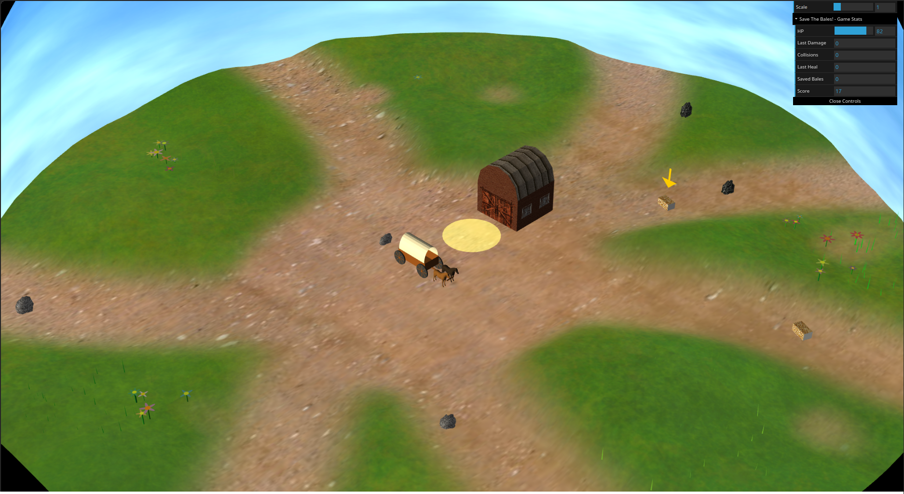
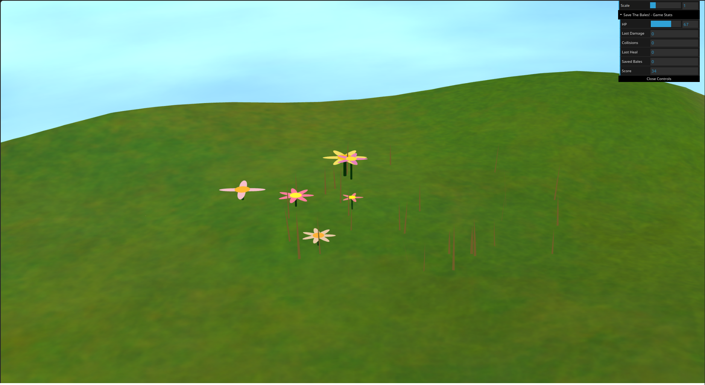
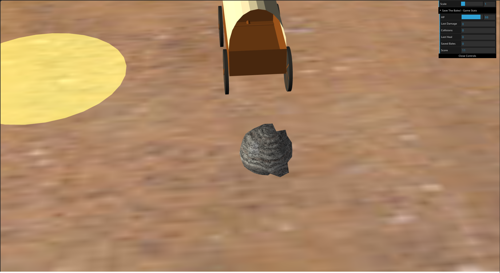
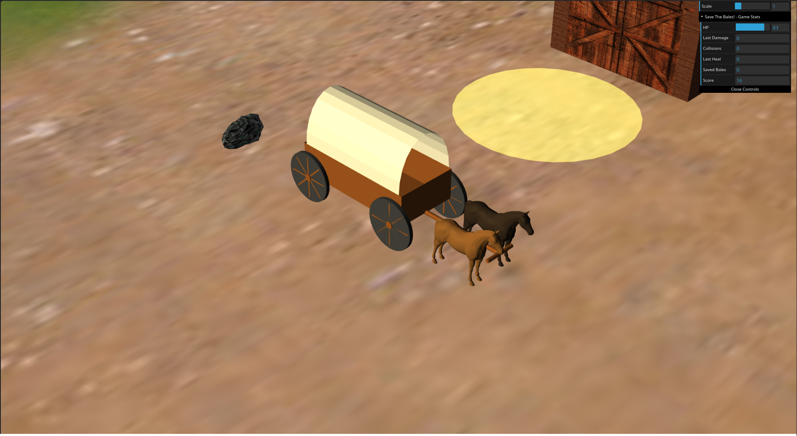
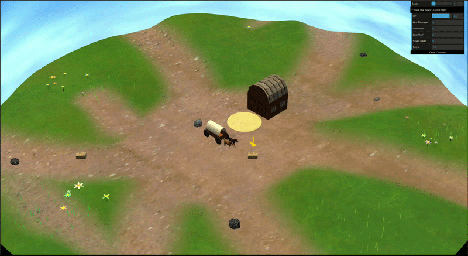

# Save The Bales!

Check the game [here!](https://casemriomjm.me/save-the-bales/)

## Group

| Name              | Number    | E-Mail            |
| ----------------- | --------- | ----------------- |
| Casemiro Medeiros | 202301897 | up202301897@up.pt |
| Heitor Brandão    | 202300401 | up202300401@up.pt |
| Sofia Cruz        | 202208135 | up202208135@up.pt |

## Scene overview

**Save The Bales!** is a survival-themed driving simulation set in an atmospheric, procedurally generated prairie landscape. The player takes control of a horse-drawn wagon with the primary objective of navigating a dirt path to collect scattered hay bales and deliver them to a central barn before their health runs out.

The scene features a dynamic environment where the terrain topography is uniquely generated for every session using procedural noise. This landscape is populated with diverse, randomized flora and scatter elements, including clustered flowers and wind-animated grass patches. A custom sky dome surrounds the world, featuring drifting clouds and a sun that tracks an orbital path, creating a changing light cycle.

Gameplay focuses on precision and resource management. The player must battle a decaying health bar, which can be replenished by successfully dropping off bales in the barn's circular drop zone. Navigational hazards include physical collisions with the barn and scattered rocks, as well as steep hills that restrict the wagon's movement to the safe, flattened dirt path. The scene is brought to life with detailed animations, including trotting horses, rotating wagon wheels, and guiding arrows that pinpoint the nearest objective.

## How to run

> _Note: all instructions here have in mind a UNIX system_

First of all unzip the project and access its root directory:

```sh
git clone git@github.com:casemiromjm/save-the-bales.git
cd save-the-bales
```

You should have three components. A `README.md` file (this), a `src/` folder with the project itself and a `lib/` folder with CGF library. 

For running the project it is only needed to start a HTTP local server, since the CGF library is shipped together with the project source code. There are a few ways to do this:

### Using Python

If you have Python 3 installed, you can easily start a server from your terminal:

```sh
python -m http.server 8080
```

Now you can access the [HTTP server](http://localhost:8080/) and check the game.

### Using VSCode Live Server

If you are using VS Code (or similar):
1. Install the **Live Server** extension by Ritwick Dey.
2. Right-click the `src/index.html` file and select **Open with Live Server**, or click the **Go Live** button in the bottom right corner of the window.
4. Your default browser should automatically open and load the project.

## Keyboard Controls

| Key | Action                                     |
| --- | ------------------------------------------ |
| W   | Move the wagon forward                     |
| A   | Turn the wagon to the left                 |
| S   | Brake the wagon                            |
| D   | Turn the wagon to the right                |
| P   | Pick up a hay bale (when close enough)     |
| L   | Drop hay bales (when in the right spot)    |
| R   | Reload the wagon (useful if you get stuck) |

_NOTE: Using `S` key only brakes the wagon, it does not move it backwards_

## Implemented Features

### Sky, clouds and sun

The sky is implemented using a custom half-sphere geometry (MyHalfSphere) surrounding the scene, textured with a clear-sky image. The base sky texture is sampled normally, while an additional cloud-noise texture is sampled with a time-dependent horizontal offset in the fragment shader ([`sky.frag`](/project/shaders/sky/sky.frag)).

The sun is also integrated in the sky shader. A sun texture is blended into a specific region of the sky using texture coordinates, allowing the sun to appear as part of the background dome. The main scene lighting was then adjusted to match the sun position visually.

#### Bonus

In The sky shader-based animation the cloud layer scrolls over time through the timeFactor uniform, producing continuous cloud movement. The sun is also composited directly in the fragment shader.

### Terrain elevation

The terrain elevation is made with a custom vertex shader ([`terrain.vert`](/project/shaders/terrain/terrain.vert)) that modifies the Z-coordinate of a plane. It utilizes a 2D value noise function to procedurally generate smooth hills and valleys based on the texture coordinates. 

The vertex shader calculates a `baseHeight` using the noise function and a `heightFactor` uniform. It then samples a `roadMask` texture to blend the procedural height down to exactly `0.0` wherever the path is drawn, ensuring a perfectly flat surface for the wagon to travel on.

#### Bonus

It relies on procedural generation. Each refresh of the page results in a different topography. This is achieved by passing a randomly generated `noiseOffset` uniform from the main scene to the shader upon initialization, which shifts the coordinates used in the noise function.

### Ground surface

The pathway is a contructed with a mask which puts the terrain elevation to 0 in said areas. When the elevation is zero, the soil shows the dirt texture instead of the grass texture.

### Scatter elements

Scattered elements such as rocks, flowers, and grass patches are distributed across the terrain using predefined coordinate zones with specified radii. Within these zones, objects are placed using randomized polar coordinates (`randomPointInZone`), ensuring a natural, clustered distribution rather than a rigid grid. Their Y-coordinates are calculated dynamically using the `TerrainSampler` so they rest accurately on the procedurally generated hills.

#### Bonus

Rocks (`MyRock`) are instantiated with random scaling across all axes and are assigned one of two textures (standard rock or granite) at random.

### Flora

Flowers (`MyFlower`) are composed by a `MyCylinder` as the stem, a `MyCircle` as the center and a custom `MyPetal`. Each flower in a zone receives randomized properties including the number of petals, stem height and radius, petal length, and color palettes for the stem, petals, and center.

#### Bonus

Our flower are procedurally constructed with varying parameters (`petalCount`, `petalLength` and `petalWidth`, `petalColor,` `stemHeight` and `stemRadius`, `stemColor`, `centerColor`) to ensure diversity.

### Grass

Grass patches (`MyGrassPatch`) are generated in clusters and consist of multiple individual blades. To add realism, there is a random chance (~35%) for a grass patch to be generated as "dead grass", which uses a yellowish/brown color palette instead of the standard green.

#### Bonus 

All grass patches are rendered using a custom wind shader (`wind.vert` and `wind.frag`) that uses a time factor to simulate the swaying motion of wind.

### Wagon

The wagon is a complex hierarchical object composed of several geometric sub-components:
- **Body**: Built using a custom `MyWagonBed` and a `MyWagonCover` for the canvas top.
- **Wheels**: Four detailed `MyWheel` objects, each consisting of a hub, rim, and procedurally placed spokes.
- **Propulsion**: Two `MyHorse` objects are harnessed to the front via a `MyWagonTongue`.

The wagon mechanics are already described in [this](#keyboard-controls) section.

#### Animation and Physics

The wagon features some animation and physics system:
- **Movement Physics**: Implements a real-time acceleration, braking, and friction model. The steering follows the movement, in other words the front axle and steering tongue rotate according to the user's input.
- **Wheel Rotation**: All four wheels rotate dynamically based on the wagon's linear velocity and the wheel radius, ensuring they never appear to slide on the ground.
- **Horse Animation**: The horses use two different 3D models (`neutral` and `walking`). Depending on the wagon's speed and an internal animation timer, the models are swapped and a vertical "bounce" is applied to simulate a natural trotting motion.
- **Environmental Constraints**: The wagon is physically restricted to the dirt path using the `TerrainSampler`'s road mask detection. Additionally, it features Axis-Aligned Bounding Box (AABB) and radial collision detection to prevent it from driving through rocks or the barn.

#### Bonus

The wagon includes a "Reset" functionality (mapped to the **R** key) that allows the player to instantly teleport back to the starting position if they become wedged in a collision or trapped by the path constraints.

### Barn

The barn is constructed using composite geometry. The base is built with a custom [`MyUnitCubeQuad`](./geometry/MyUnitCubeQuad.js) which allows different textures to be applied to each face. The front, sides, and roof faces are textured with distinct maps ([`barnFront.jpg`](./textures/barn/barnFront.jpg), [`barnSide.jpg`](./textures/barn/barnSide.jpg), [`woodPlanks.jpg`](./textures/barn/woodPlanks.jpg)) to represent windows, doors, and wooden panels. The roof is composed of a [`MyHalfPrism`](./geometry/MyHalfPrism.js) and two [`MyHalfCircle`](./geometry/MyHalfCircle.js) caps. This way we were able to have different textures for the caps and have a better looking barn. We also have a delimited circular area in front of the barn to show where the user can drop the bales.

#### Bonus

When the wagon is inside the circular drop zone area, the area changes it color to green to give a visual feedback to the player.

### Interface Elements

All UI elements are implemented with DAT.gui. The Game Over pop up is rendered with html to have a better look and better funcionality.

#### Bonus

In order to ensure the HP and the score are alligned, we decided to pause the game when the tab is not focused. This way we mitigate the scenario in which the score increase way more than the HP decrease (e.g. 130 points with 0 bales, but the expected was 100 points with 0 bales).

### Animation

In our wagon we have movement in all four wheels when those are moving. We also have movement in the horses to simulate trot, we also change the horse `.obj` to another one that has more movement effect to give more the walking feeling. The front tongue of the wagon moves towards the movement direction.

The pinpointing arrows also have some shaky movement to draw attention.

### Shaders

As said before, the grass has the wind movement. Also, the vertical arrows shake a bit to catch the player attention to the hay bales.

## Known Issues

### Sun distortion at Zenith

Currently, when the sun reaches the highest point in the sky (the zenith), it suffers from a distortion effect similar to a "black hole". Because the sun's texture is mapped onto a sphere using spherical coordinates (u, v), the texture becomes severely pinched and compressed at the poles (where v = 0). This causes the sun to shrink and stretch until it briefly disappears before reappearing as it descends on the opposite side.

### Terrain illumination

The terrain illumination is not being fully computed since the custom shader overwrites the default lighting. To solve this, we should recalculate the normals, pass the sun light direction to the shaders and, finally, calculate the new light inside the shaders.

### Wagon reaction to the terrain

Right now the wagon is not allowed to move over the hills. However, if you force your way the wagon still gets a little inside the hill before getting stuck. If the you got stuck, you can always use `R` to reset the wagon position.

### Camera movement controlled by the mouse

The camera follow the wagon by default. However, the user can force the mouse control, which cause a strange flickering effect.

### Collision

Some collision are a bit harcoded (barn, drop zone area). This means, if we changed the scene placement we would need to redo the collisions.

Also about this subject, the rock collision sometimes do not trigger the wagon reset and sometimes it damage the wagon, but it does not brake it.

## Screenshots

### Scene overview



### Flowers, rocks, and terrain detail





### Wagon close-up



### Shaders in action



In this gif is possible to see all the shaders in action. Windy grass, drop zone pulsating, shaky pinpoint arrow, clouds and the sun.

## AI Usage

AI was used to:

- generate the triangles in grass patches.
- create mix and fract functions in TerrainSampler.
- the read image approach in TerrainSampler.
- create zones for scatter elements.
- CSS used in Game Over pop up
- grammar check of some fragments of this readme.
- (non trivial) math calculations used in geometries.
- the hay bale placement at the wagon.
